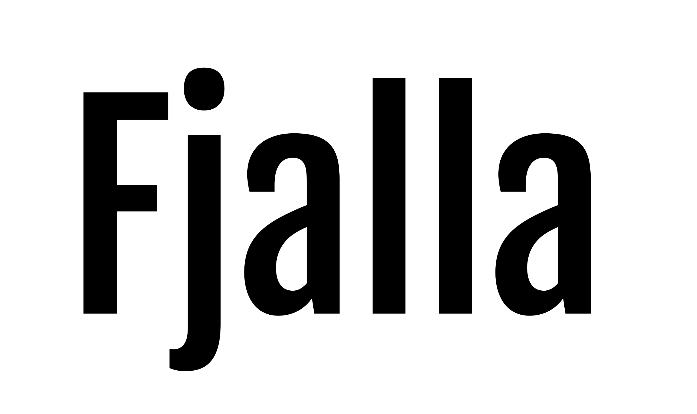
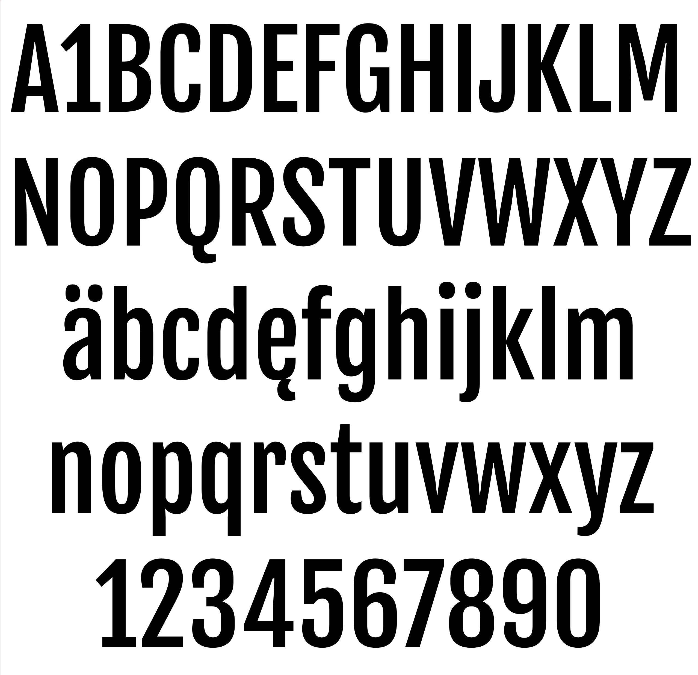

# FjallaOne

[Fontbakery]: https://img.shields.io/endpoint?url=https%3A%2F%2Fraw.githubusercontent.com%2FEbenSorkin%2FFjallaOne%2Fgh-pages%2Fbadges%2Foverall.json
[GF Profile]: https://img.shields.io/endpoint?url=https%3A%2F%2Fraw.githubusercontent.com%2FEbenSorkin%2FFjallaOne%2Fgh-pages%2Fbadges%2FGoogleFonts.json
[Outline Correctness]: https://img.shields.io/endpoint?url=https%3A%2F%2Fraw.githubusercontent.com%2FEbenSorkin%2FFjallaOne%2Fgh-pages%2Fbadges%2FOutlineCorrectnessChecks.json
[Shaping]: https://img.shields.io/endpoint?url=https%3A%2F%2Fraw.githubusercontent.com%2FEbenSorkin%2FFjallaOne%2Fgh-pages%2Fbadges%2FShapingChecks.json
[Universal]: https://img.shields.io/endpoint?url=https%3A%2F%2Fraw.githubusercontent.com%2FEbenSorkin%2FFjallaOne%2Fgh-pages%2Fbadges%2FUniversal.json

Fjalla is a medium contrast display sans serif. Fjalla has been carefully adjusted to the restrictions of the screen. Despite having display characteristics Fjalla can be used in a wide range of sizes.

## About

Sorkin Type makes retail and Libre fonts.

## Building

Fonts are built automatically by GitHub Actions - take a look in the "Actions" tab for the latest build.

If you want to build fonts manually on your own computer:

* `make build` will produce font files.
* `make test` will run [FontBakery](https://github.com/googlefonts/fontbakery)'s quality assurance tests.
* `make proof` will generate HTML proof files.

The proof files and QA tests are also available automatically via GitHub Actions - look at https://EbenSorkin.github.io/FjallaOne.

## ChangeLog

27 Oct 2012 (Eben Sorkin) Fjalla v1.000
- Mastered VBF to TTF and other formats.
- hinted font Using TTFAutohint version 0.92

25 Oct 2012 (Irina Smirnova) Fjalla v1.000
- Completed first complete version of Fjalla in Fontlab ( VBF format )

28 July 2017 (eben Sorkin) v 1.001
- increased the glyphs to support addiional languages
- The diacritics are now sourced from unicode 0300 series codepoints with zero width instead of the previous default 0200 codepoints. 
- Legacy diacritics (0200 codepoints) remain with some left and right spacing in case they need to be referenced in text. 
- Vertical metrics have ben made consistent with current Google practice to avoid clipping. 
- OpenType naming tables are added and have NID 16 & 17 entries so that Font Menus in Adobe apps say Fjalla with a style of "One"

2 March 2023 (Eben Sorkin and Emma Marichal) V1.002
- kerning added and completed
- language supported improved

### Acknowledgements

If you make modifications be sure to add your name (N), email (E), web-address
(if you have one) (W) and description (D). This list is in alphabetical order.

N: Emma Marichal
E: bonjour@emmamarichal.fr
W: emmamarichal.fr
D: Mastering

N: Irina Smirnova
E: irina.v.sm@gmail.com
D: Designer

N: Eben Sorkin
E: sorkineben@gmail.com
W: www.sorkintype.com
D: Mastering & Design

## License

This Font Software is licensed under the SIL Open Font License, Version 1.1.
This license is available with a FAQ at
https://scripts.sil.org/OFL

## Repository Layout

This font repository structure is inspired by [Unified Font Repository v0.3](https://github.com/unified-font-repository/Unified-Font-Repository), modified for the Google Fonts workflow.
